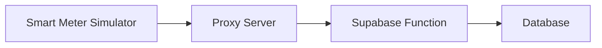

# Aurora Smart Meter Deployment Configuration Verification

## Current Deployment Status ✅

Based on our tests, your deployment configuration is **correctly structured** and working properly:

| Component | URL | Status |
|-----------|-----|--------|
| Proxy Server | https://aurora-smart-meter-proxy.onrender.com | ✅ Running |
| Smart Meter Simulator | https://smart-simulator.netlify.app/ | ✅ Deployed |
| Dashboard | auroraenergy.app | ✅ Accessible |

## Connection Test Results ✅

All connection tests have been successful:
- Direct server connection test: ✅ Status 200
- Proxy endpoint test with sample data: ✅ Status 200
- Proxy endpoint test with exact smart meter data structure: ✅ Status 200

The proxy server is correctly:
1. Accepting requests from your Netlify-deployed smart meter simulator
2. Forwarding data to the Supabase function
3. Returning proper responses

## How It Works



1. Smart meter simulator sends data to the proxy server
2. Proxy server forwards the request to Supabase function
3. Supabase function processes the data and stores it
4. Response is sent back through the proxy to the smart meter

## Troubleshooting Network Errors

If you're experiencing network errors, try these steps:

### 1. Verify Proxy Server Status
Check if the proxy server is running:
```bash
curl -X GET https://aurora-smart-meter-proxy.onrender.com/health
```

### 2. Test Browser Connection
Open the [browser-connection-test.html](browser-connection-test.html) file in your browser to run a direct test.

### 3. Check Smart Meter Configuration
Ensure the smart meter HTML file has the correct proxy URL:
```javascript
const AURORA_CONFIG = {
  // ... other config
  proxyUrl: 'https://aurora-smart-meter-proxy.onrender.com/proxy/supabase-function'
};
```

### 4. Verify CORS Configuration
The proxy server is configured to accept requests from:
- https://*.netlify.app (includes your smart meter simulator)
- https://aurora-smart-meter.onrender.com
- http://localhost:3000, http://localhost:3001 (for local development)

### 5. Check Network Console
In your browser's developer tools:
1. Open the Network tab
2. Run the smart meter
3. Look for failed requests to the proxy server
4. Check the error details

## Common Issues and Solutions

### Issue: "Network Error: Unable to send data to proxy server"
**Solution:** 
1. Verify the proxy server is running by visiting https://aurora-smart-meter-proxy.onrender.com
2. Check that the proxy URL in smart-meter.html is correct
3. Ensure you're not behind a firewall blocking the connection

### Issue: "TypeError: Failed to fetch"
**Solution:**
1. This is usually a CORS issue, but your proxy server should handle this
2. Verify the proxy server's CORS configuration includes your domain
3. Check that you're using the correct endpoint (/proxy/supabase-function)

### Issue: Data not appearing in dashboard
**Solution:**
1. Verify the smart meter is sending data successfully (check response in UI)
2. Confirm the user ID and meter number are correctly registered
3. Check the Supabase function logs for any processing errors

## Next Steps

1. **Test the complete flow**: Run the smart meter simulator and verify data appears in the dashboard
2. **Monitor logs**: Check the proxy server logs on Render for any issues
3. **User testing**: Have actual users test the registration and data submission flow

## Support

If you continue to experience issues:
1. Check the browser console for detailed error messages
2. Verify all URLs are correct
3. Ensure the proxy server is running (check Render dashboard)
4. Contact support with specific error messages and timestamps

---
*Document generated on September 27, 2025*